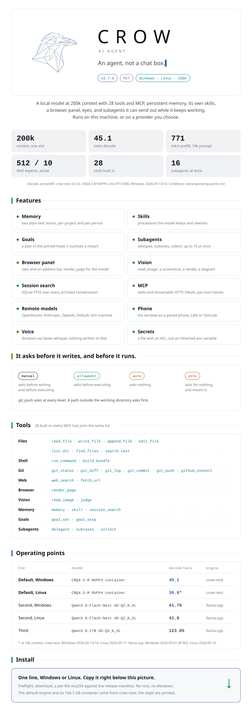

<picture>
  <source media="(prefers-color-scheme: dark)" srcset="docs/images/readme/crow-dark.svg">
  
</picture>

**Linux**

```bash
curl -fsSL https://raw.githubusercontent.com/nibor1896/Crow/main/install.sh | bash
```

**Windows**

```powershell
irm https://raw.githubusercontent.com/nibor1896/Crow/main/install.ps1 | iex
```

<p align="center">
<a href="docs/README.md#user-guide">User guide</a> ·
<a href="docs/README.md#reference">Reference</a> ·
<a href="docs/README.md#operating-points-and-measurements">Operating points and measurements</a> ·
<a href="docs/README.md#developer-guide">Developer guide</a> ·
<a href="docs/README.md#plans">Plans</a> ·
<a href="docs/README.md#archive">Archive</a>
</p>

<p align="center"><sub>
MIT · <a href="https://github.com/nibor1896/crow">nibor1896/crow</a> ·
Model: <a href="https://huggingface.co/nibor1896/Qwen3.8-Flash-Next-CNQ4.5-M">Qwen3.8-Flash-Next CNQ4.5-M</a> (Qwen Community License 1.0) ·
Engine: <a href="https://github.com/nibor1896/crow-nest">crow-nest</a> ·
GGUF line: <a href="https://huggingface.co/unsloth">Unsloth</a>, <a href="https://github.com/ggml-org/llama.cpp">llama.cpp</a>
</sub></p>

<p align="center">
<a href="https://ko-fi.com/nibor1896"><picture>
  <source media="(prefers-color-scheme: dark)" srcset="docs/images/readme/kofi-dark.svg">
  
</picture></a>
</p>
